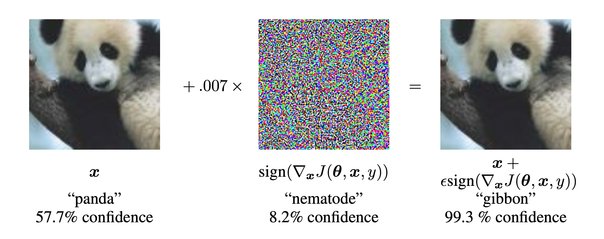

# Adversarial Attack
A library for conducting Adversarial Attacks on pytorch image classifier models.

## Overview
Adversarial Attack is a Python library that provides a simple API and CLI for conducting adversarial Fast Gradient Sign Method (FGSM) (https://arxiv.org/abs/1412.6572) attacks on PyTorch image classifier models.

The paper demonstrates that it is possible to generate adversarial examples by adding small perturbations to the input image that are imperceptible to the human eye but can cause the model to misclassify the image.
This is acomploshed by taking the gradient of the loss function with respect to the input image and then adding a small perturbation in the direction that increases the loss the most.


The above image (taken from the FGSM paper) illstrates the result of an FGSM attack that has been able to trick the model into classifying a panda as a gibbon. To the human there is no discernable difference between the two images.

The library implements the standard FGSM attack and a targeted FGSM attack. The standard attack aims to generate an adversarial image that is misclassified by the model, while the targeted attack aims to generate an adversarial image that is misclassified as a specific target category.

The library comes with a set of pre-trained PyTorch models (e.g., ResNet18, ResNet50) and utility functions for loading images, preprocessing images. However, users can also use their own models and images but must include their own preprocessing and loading steps (see *Running via API* section).

We observe a success rate of 96.30% for the standard attack and a success rate of 89.63% for the targeted attack. Both attack mechanisms are tested on a set of sample images taken from the ILSVRC2012 validation dataset and using the models `resnet50`, `resnet101` and `resnet152`. See the section *End-to-End Tests* for more details. 

## Design
The library has been designed to be easily integratable into any pipeline, either through the API or through the CLI interface. Although only two attacks are present the codebase has been designed to be easily extendable by separating out utilities specific to the models and the actual attack mechanism. 
To add a new mechanism the developer or user would only need to add the attack functionality and update the `get_attack_fn` to incorporate the new attack. 

## Installation
Adversarial Attack can be installed by first cloning the repository and the installing dependecies using pip. It is reccomended to use a virtual environment to install dependencies.

```
git clone git@github.com:tomcarter23/adversarial_attack.git
cd adversarial_attack
python -m venv venv
source venv/bin/activate
pip install -e . 
```

Developers of the project can install extra dependencies that allow the running of the testing suite

```
pip install -e ".[test]" 
```

## Running via CLI

You can run the adversarial attack from the command line interface (CLI). Here's the general syntax:

```bash
python -m adversarial_attack --model <MODEL_NAME> --mode <MODE> --image <IMAGE_PATH> --category-truth <TRUE_CATEGORY> --category-target <TARGET_CATEGORY> --epsilon <EPSILON> --max-iterations <MAX_ITER> --output <OUTPUT_PATH> --log <LOG_LEVEL>
```
### Parameters:

- `--model, -m`: The model to attack (e.g., `resnet18`, `resnet50`) (required).
- `--mode`: The type of attack (optional):
  - `standard`: Standard FGSM attack.
  - `targeted`: Targeted FGSM attack (default).
- `--image, -i`: Path to the input image to attack (required).
- `--category-truth, -c`: The true class label of the image (e.g., `cat`) (required).
- `--category-target, -ct`: The target class label for the targeted attack (only required for targeted mode).
- `--epsilon, -eps`: The epsilon value for the attack (optional. default: `1.0e-3`).
- `--max-iterations, -it`: Maximum number of iterations for the FGSM attack (optional. default: `50`).
- `--output, -o`: Path to save the resulting adversarial image (optional).
- `--log, -l`: Log level (e.g., `DEBUG`, `INFO`, `WARNING`, `ERROR`, `CRITICAL`) (optional).


## Running via API
You can also use the library via the provided API to perform adversarial attacks programmatically on any PyTorch model.

Example usage:

import torch
from adversarial_attack.api import perform_attack
from adversarial_attack.resnet_utils import load_model_default_weights, get_model_categories, load_image, preprocess_image

```
# Load the model from provided in resnet_utils or use your own
model = resnet_utils.load_model_default_weights(model_name='resnet18')

# Load and preprocess the image using provided resnet_utils functions or use your own
image = resnet_utils.load_image('path/to/image.jpg')
image_tensor = resnet_utils.preprocess_image(image)

# Define the categories for the model
categories = resnet_utils.get_model_categories('resnet18')

# Perform the attack
result_image_tensor = perform_attack(
    mode='targeted',  # or 'standard'
    model=model,
    image=image_tensor,
    categories=categories,
    true_category='cat',
    target_category='dog',  # required only for targeted attack
    epsilon=1.0e-3,
    max_iter=50
)

result_image = Image.fromarray(np.uint8(255 * to_array(result_image_tensor)))

# Save the resulting adversarial image
if result_image is not None:
    result_image.save('path/to/output.jpg')
```

## Running CLI via Docker

The library can also be run via Docker. To build the Docker image, run the following command:

```bash
docker build -t adversarial_attack .
```

The latest version of the library is available on Docker Hub. To pull the image, run the following command:

```bash
docker pull tomcarter23/adversarial_attack
```

To run the Docker container and CLI, use the following command as an example:

```bash
docker run -v /path/to/images:/app/images -v /path/to/output:/app/output tomcarter23/adversarial_attack python -m adversarial_attack --model resnet50 --mode targeted --image ./images/goldfish.JPEG --category-truth goldfish --category-target hare --epsilon 1.0e-3 --max-iterations 50 --output ./output/adversarial_goldfish.JPEG --log DEBUG

```

The command mounts the `/path/to/images` directory to the `/app/images` directory in the container and the `/path/to/output` directory to the `/app/output` directory in the container. The command then runs the adversarial attack on the `goldfish.JPEG` image in the `/images` directory and saves the resulting adversarial image as `adversarial_goldfish.JPEG` in the `/output` directory.

## Running Two Examples via Make

Possibly the simplest way to run some examples is through the `make` command. Two examples have been pre-prepared in the `Makefile` to demonstrate the use of the library. These are the `example_standard` and `example_targeted` commands.

To run: 
    
```bash
make example_standard
```
and 
    
```bash
make example_targeted
```

The commands will use the latest docker image of the library and run the standard and targeted attacks on the `lionfish_ILSVRC2012_val_00019791.JPEG` example image. Output images will be saved in the newly created `output` directory and information about the attack will be printed to the console.

## Specific Example

The `sample_images/imagenet` directory contains a set of example images from the ILSCVR2012 Imagenet validation dataset which constitute part of the same dataset that the pre-trained models were trained on. 
The images are named according to their true class label (e.g., `lawn_mower_ILSVRC2012_val_00020327.JPEG`), where the true class label is the part of the filename before the `ILSVRC2012` identifier. 
True classes in each of the provided models do not contain underscores e.g. `lawn mower`. This format should be used if using these sample images for testing.

The following command demonstrates how to run a targeted adversarial attack on a ResNet50 model using the `hare` image from the `sample_images` directory. 
The target category is `goldfish`, and the epsilon value is `1.0e-3` with a maximum of `50` iterations. The resulting adversarial image is saved as `output_images/hare_to_goldfish.jpg`.

```bash
python -m adversarial_attack --model resnet50 --mode targeted --image sample_images/imagenet/hare_ILSVRC2012_val_00004064.JPEG --category-truth hare --category-target goldfish --epsilon 1.0e-3 --max-iterations 50 --output output_images/hare_to_goldfish.JPEG --log DEBUG
```

The following table shows the original and perturbed images generated by the above command:


| Orignal Image                                                        | Perturbed Image                                 |
|----------------------------------------------------------------------|-------------------------------------------------|
| Classification: `hare`                                               | Classification: `goldfish`                      |
| Confidence: 0.44                                                     | Probability: 0.25                               |
|  |  |

As can be seen, the perturbed image is misclassified by the model as the target category `goldfish` with a confidence of `0.25`. The perturbed image looks almost identical to the original image, demonstrating the effectiveness of the adversarial attack and the limitations of the model.

NOTE: The perturbed image is a cropped version of the original image due to the preprocessing steps needed to pass the image throught the model. The perturbed image could be upscaled using information from the original image. This is left as future work. 
## Testing

### Unit Tests

The library comes with a set of unit tests that can be run using the following command:

```bash
pytest tests/unit -v
```

These unit tests cover the core functionality of the library, including loading models, images, and performing adversarial attacks. 

The tests use mocking where appropriate to isolate the testing of individual components of the library.

### End-to-End Tests


The library also comes with a set of end-to-end tests that can be run using the following command:

```bash
pytest tests/e2e -v
```

The end-to-end tests are broken down into two categories: standard and targeted attacks. 

The standard attack tests test the success rate of the standard FGSM attack on the set of `sample_images` for the default models `resnet50`,  `resnet101` and `resnet152`. We observe a success rate of `96.30%` across all 27 tests.

The targeted attack tests test the success rate of the targeted FGSM attack on the set of `sample_images` for the default models `resnet50`,  `resnet101` and `resnet152`. For each image and model the target attack using the target category of the other remaining 8 categories that are represented in the `sample_images` directory. We observe a success rate of `89.63%` across all 270 tests.

Failures for each type of tests typically occur when the models original prediction does not match the true category of the image. When this occurs performing an attack is pointless and the attack fails. 

## To Do: 

- Add more attack mechanisms
  - Projected Gradient Descent (PGD)
  - Black box attacks where the gradient is unknown
- Add support for more models out of the box. There are many more image classification models that could be supported such those in torchvision but also others within Huggingface for example
- Implement a release workflow and publish the repo on PyPI 
- Notebook tutorial of using the API with a custom PyTorch model
- More in depth testing and reporting into attack  
